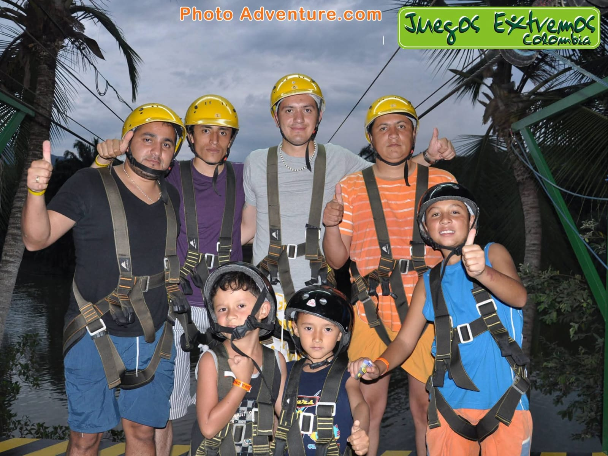
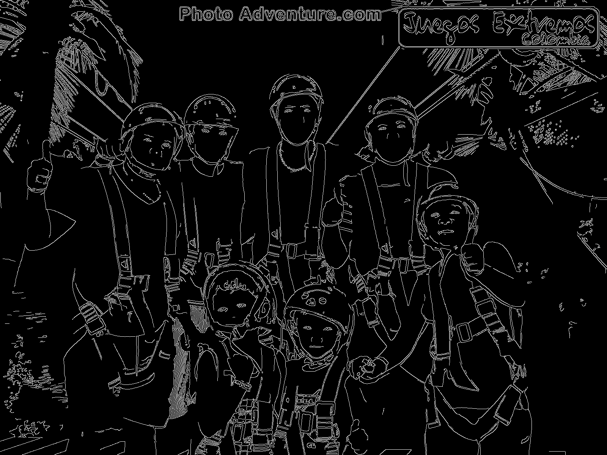
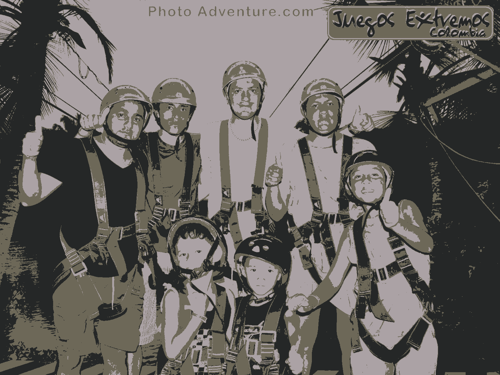

<p align="center">
  
</p>

<h1 align="center">Aplicaciones de Computer Vision / Computer Vision Applications</h1>

<p align="center">
  <em>Autor:</em> <strong>Juan Esteban Castilla Baquero</strong> · 

</p>

<p align="center">
  
  
  
  
</p>

---

## Descripción general (Español)

Este proyecto implementa un flujo completo de procesamiento digital de imágenes utilizando **OpenCV** y **Scikit-Image**.  
El objetivo es aplicar los fundamentos de la **visión por computador**: lectura, conversión de color, transformaciones geométricas, filtrado, detección de bordes, reconocimiento facial y segmentación mediante umbralización y clustering.


---

##  Overview (English)

This project implements a complete image processing workflow using **OpenCV** and **Scikit-Image**.  
The main goal is to apply **computer vision** fundamentals: image loading, color conversion, geometric transformations, filtering, edge detection, face recognition, and segmentation through thresholding and clustering.


---

##  Estructura / Project Structure
```bash
Proyecto_ComputerVision/
│
├── venv/ # Entorno virtual / Virtual environment
├── cv_practica.py # Script principal / Main script
├── outputs/ # Resultados / Output images
│ ├── imagen_01_original.png
│ ├── imagen_02_gris.png
│ ├── imagen_03_redimension_200x200.png
│ ├── imagen_04_rotada_45.png
│ ├── imagen_05_crop_centro_200px.png
│ ├── imagen_06_suavizado_gauss.png
│ ├── imagen_07_bordes_canny.png
│ ├── imagen_08_caras_haar.png
│ ├── imagen_09_otsu.png
│ ├── imagen_10_adaptativa.png
│ ├── imagen_10b_adaptativa_sk.png
│ └── imagen_11_kmeans_K3.png
└── README.md
```
---

## Instalación / Installation


```bash

# Crear entorno virtual / Create virtual environment
python -m venv venv
source venv/bin/activate     # or .\venv\Scripts\activate (Windows)

# Instalar dependencias / Install dependencies
pip install opencv-python scikit-image numpy
``` 
## Ejecución

```bash
python cv_practica.py --image "ruta/a/tu_imagen.jpg" --out outputs
```

| Parámetro / Argument | Descripción / Description                   | Valor por defecto / Default |
| -------------------- | ------------------------------------------- | --------------------------- |
| `--roi`              | Tamaño del recorte centrado / ROI crop size | 200                         |
| `--out`              | Carpeta de salida / Output folder           | outputs                     |

## Etapas del procesamiento / Processing stages

| Nº  | Etapa           | Stage         | Descripción breve / Short description           |
| --- | ------------------------- | ----------------------- | ----------------------------------------------- |
| 01  | Imagen original           | Original image          | Lectura base en color / Base color image        |
| 02  | Escala de grises          | Grayscale               | Conversión a luminancia / Light intensity map   |
| 03  | Redimensionado            | Resizing                | Ajuste de tamaño / Scale normalization          |
| 04  | Rotación 45°              | Rotation 45°            | Transformación geométrica / Geometric transform |
| 05  | Recorte central           | Central crop            | ROI extraction / Focus on main region           |
| 06  | Suavizado Gaussiano       | Gaussian blur           | Reducción de ruido / Noise reduction            |
| 07  | Bordes Canny              | Canny edges             | Detección de contornos / Edge detection         |
| 08  | Detección de caras        | Face detection          | Clasificador Haar / Haar cascade classifier     |
| 09  | Otsu global               | Global Otsu             | Umbral automático / Global threshold            |
| 10  | Adaptativa (OpenCV)       | Adaptive (OpenCV)       | Umbral local / Local threshold                  |
| 10b | Adaptativa (Scikit-Image) | Adaptive (Scikit-Image) | Vecindad local / Neighborhood threshold         |
| 11  | Segmentación K-Means      | K-Means segmentation    | Agrupamiento por color / Color clustering       |


## Resultados / Results
<p align="center">   <br> <em>Ejemplos: original, bordes detectados y segmentación por color. Examples: original image, edge detection and color segmentation.</em> </p>

--- 
## Conclusiones / Conclusions

- Las transformaciones geométricas prepararon la imagen para análisis posteriores.  
  *Geometric transformations prepared the image for later analysis.*

- El filtro gaussiano redujo el ruido sin afectar bordes importantes.  
  *The Gaussian filter reduced noise while preserving main edges.*

- El detector Haar identificó la mayoría de rostros con precisión aceptable.  
  *The Haar classifier detected most faces with fair accuracy.*

- Los métodos de umbralización y segmentación por color simplificaron la escena.  
  *Thresholding and color clustering simplified the image into meaningful regions.*

## Aplicaciones / Applications

- **Ingeniería industrial / Industrial Engineering:** Control de calidad mediante visión artificial / Quality control through computer vision.  
- **Machine Learning:** Preparación de conjuntos de datos visuales / Visual dataset preprocessing.  
- **Reconocimiento facial / Face Recognition:** Detección de personas y características faciales / Human feature detection.  
- **Docencia / Education:** Enseñanza práctica de procesamiento visual / Educational demonstrations in computer vision.  

## Referencias / References

- OpenCV Team. (2024). *OpenCV Documentation* [Manual en línea]. https://docs.opencv.org/  
- Van der Walt, S., Schönberger, J. L., Nunez-Iglesias, J., Boulogne, F., Warner, J. D., & otros. (2014). *scikit-image: Image processing in Python.* *PeerJ, 2*, e453. https://doi.org/10.7717/peerj.453  

<p align="center"> <sub>© 2025 Juan Esteban Castilla Baquero · Proyecto académico sin fines comerciales / Academic project for educational purposes</sub><br>   </p> 